<!--
  GitHub profile README for @Rand0miz — variant 2 (terminal / phosphor)
  Repo must be named Rand0miz/Rand0miz with this file at the root.
  See SETUP.md before pushing.
-->

<div align="center">
  
</div>

<div align="center">
  <a href="mailto:mylestechbot@gmail.com"></a>
  <a href="https://github.com/Rand0miz?tab=repositories"></a>
  
  
</div>

<br>

```console
$ cat /etc/motd
```

> **Long context is a budgeting problem, not a memory problem.**
> Every token spent on filler is a token not spent on the answer.

<br>

## `$ cat about.md`

I work on **inference-time infrastructure for language models** — the layer sitting between a raw
corpus and the tokens a model actually sees. Concretely: context compilers. Read a document far
larger than the window, score it with the model's own attention, emit only the blocks carrying the
answer, and prove the needle survived.

<div align="center">
  <picture>
    <source media="(prefers-color-scheme: dark)" srcset="https://raw.githubusercontent.com/Rand0miz/Rand0miz/output/github-contribution-grid-snake-dark.svg" />
    <source media="(prefers-color-scheme: light)" srcset="https://raw.githubusercontent.com/Rand0miz/Rand0miz/output/github-contribution-grid-snake.svg" />
    
  </picture>
</div>

<br>

## `$ tree ~/stack`

```console
~/stack
├── models/
│   ├── pytorch ················ training + inference loops
│   ├── transformers ··········· Qwen, Llama, tokenizers, generation
│   ├── cuda ··················· kernels, memory, occupancy
│   └── attention/
│       ├── sdpa ··············· default fast path
│       └── flash ·············· long-sequence regime
├── lang/
│   ├── python ················· 71.4%
│   ├── cuda+cpp ··············· 11.8%
│   ├── rust ··················· 7.9%
│   └── typescript ············· 5.2%
├── infra/
│   ├── docker · linux · git
│   └── github-actions
└── principles/
    ├── measure_compression_AND_recall.md
    ├── a_benchmark_you_cant_reproduce_is_a_screenshot.md
    └── the_baseline_is_not_optional.md

6 directories, 15 files
```

<br>

## `$ git log --stat --author=Rand0miz`

<div align="center">
  
  
</div>

<div align="center">
  
</div>

<div align="center">
  
</div>

<br>

## `$ ls -la ~/projects`

```console
drwxr-xr-x  sprucekit    context compiler · 422 KB in, 4 blocks out, needle intact
drwxr-xr-x  Valkyrie     API diven local file storage and retrival solution.
-rw-r--r--  .plan        sub-1% compression without losing the answer span
```

<div align="center">
  <a href="https://github.com/Rand0miz/sprucekit">
    
  </a>
  <a href="https://github.com/Rand0miz/Valkyrie">
    
  </a>
</div>

<br>

## `$ ps aux | grep myles`

```console
PID   STAT  COMMAND
2847  R     spruce --target-compression 0.004 --preserve-answer-span
2848  R     bench --needle-recall --report-baseline
2849  S     read  papers/long-context/*.pdf
2850  S     mail  mylestechbot@gmail.com   # open to inference-infra conversations
```

<div align="center">
  
</div>

<div align="center">
  <sub><code>exit 0</code></sub>
</div>
